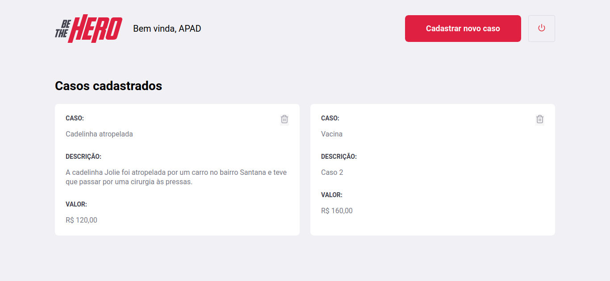

# omnistack11
 
Aplicação desenvolvida seguindo o evento semana Omnistack 11 da Rockseat com foco no uso das tecnologias: Node.js, ReactJS e React Native.
Be The Hero é um projeto que visa conectar ONGs que precisam de auxílio para resolver seu incidentes com pessoas que querem ajudar financeiramente alguma dessas ONGs. Na aplicação web, o usuário pode cadastrar sua ONG e fazer o login a partir de um id único. Em seguida é possível fazer o cadastro dos incidentes que precisam de ajuda ou deletar aqueles que já foram resolvidos. No app mobile, o usuário consegue ver a lista de todos os casos cadastrados pelas ONGs e entrar em contato através de e-mail ou Whatsapp sem sair do aplicativo.

  

  

  

  

  
  
  

# Funcionalidades
## Web
 - Login, logout e cadastro de uma ONG.
 - Cadastrar, listar e deletar um novo caso.

## Mobile
 - Listagem dos casos cadastrados
 - Envio de mensagem por e-mail ou Whatsapp
 - Scroll infinito para mais de 5 casos

# Principais Tecnologias
 - Node.js
 - ReactJS
 - React Native
 - Expo
 - SQLite 
 - Knex
 - Cors
 - Celebrate
 - Jest